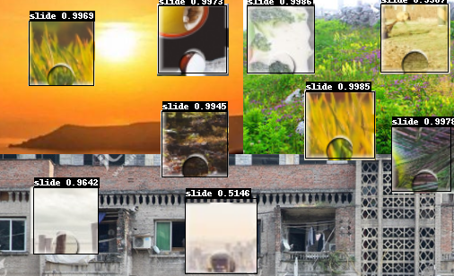

#####  ppyolo 滑动验证码识别

快速开始：

1. 下载该项目
2. 在Releases中下载paramas文件放置相应目录


---------------------------------使用效果展示-----------------------------------------
```python
python predict.py

if __name__ == '__main__':
    print('加载模型开始预测>>')
    # 默认识别imgs目录下所有图片
    main()

C:\python3\python.exe E:/ppyolo-captcha/predict.py
加载模型开始预测>>
-----------  Model Configuration -----------
Model Arch: YOLO
Use Paddle Executor: False
Transform Order: 
--transform op: Resize
--transform op: Normalize
--transform op: Permute
--------------------------------------------
Inference: 988.569974899292 ms per batch image
class_id:0, confidence:0.9984,left_top:[308.86,80.42], right_bottom:[386.09,156.56]
class_id:0, confidence:0.9983,left_top:[7.50,79.58], right_bottom:[83.79,155.57]
save result to: ./output\captcha_301.png
{'boxes': array([[  0.       ,   0.9983951, 308.85504  ,  80.422195 , 386.08887  ,
        156.56035  ],
       [  0.       ,   0.9982862,   7.497284 ,  79.57634  ,  83.786804 ,
        155.5662   ]], dtype=float32)} ===============================================

```


##### 识别效果如下


 																				




快拿去玩吧
